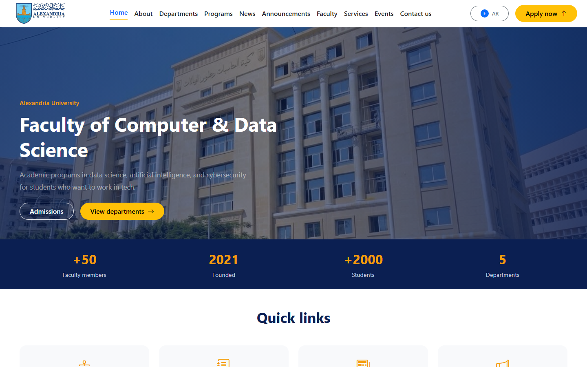
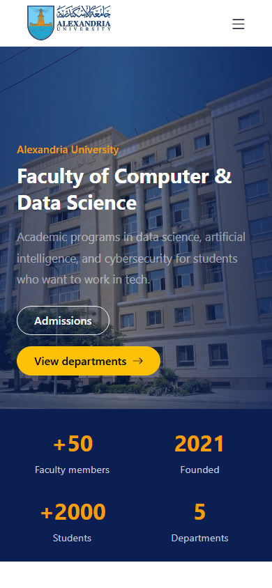
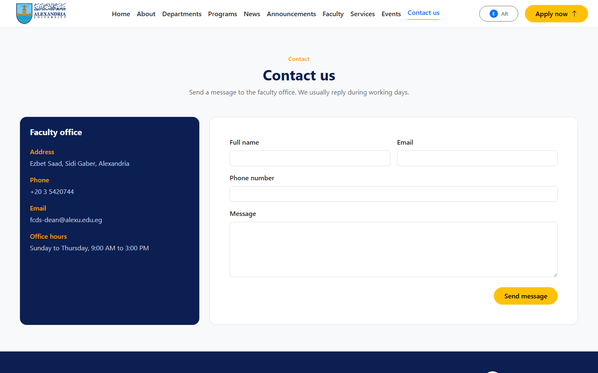

# FCDS Website

## Overview

This is a front-end site for the Faculty of Computer and Data Science at Alexandria University. It is built with React and Vite and supports Arabic and English through i18n, with RTL and LTR layout switching.

Text and structure follow the official faculty websites:

- https://fcds.alexu.edu.eg/index.php/en/
- https://fcds.alexu.edu.eg/index.php/ar/

## Features

- Home page with hero, stats, quick links, departments, programs, news, announcements, services, and events
- Departments list and department details
- Programs page
- News list with search and filter, plus news details
- Announcements with search and filter
- Faculty list with search and filter, plus faculty details
- Services page
- Events page
- Contact form with validation
- Language switcher (Arabic / English)
- Responsive layout and 404 page

## Technologies

- React 19
- Vite
- React Router
- Bootstrap 5 and Bootstrap Icons
- i18next / react-i18next

## Installation

```bash
npm install
npm run dev
```

Open http://localhost:5173.

## Build

```bash
npm run build
npm run preview
```

## Screenshots

Screenshots were taken in English (`localStorage.lang = en`) from a production preview build.

### Home (desktop)



### Home (mobile)



### News


### Contact



## Project structure

```text
src/
  assets/locales/   # ar and en translation files
  components/       # layout and shared UI
  data/             # mock data files
  pages/            # route pages and home sections
  i18n.js
  App.jsx
```

## Routes

- `/` Home
- `/about` About
- `/dean-message` Dean message
- `/departments` Departments
- `/departments/:key` Department details
- `/programs` Programs
- `/news` News
- `/news/:key` News details
- `/announcements` Announcements
- `/faculty` Faculty
- `/faculty/:key` Faculty details
- `/services` Services
- `/events` Events
- `/contact` Contact

## i18n and RTL / LTR

See [docs/i18n.md](docs/i18n.md).
